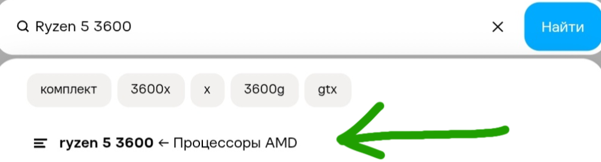
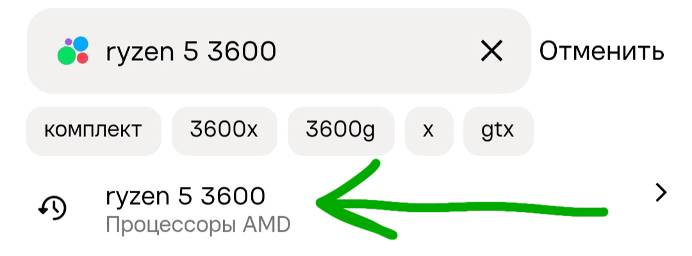

Работа над программой всё ещё ведётся, и завершена примерно на 80%.

# AvitoMonitoring
Легковесная программа для мониторинга категорий Авито на факт появления новых объявлений по низкой цене.

## Описание работы бота

После запуска нового экземпляра программы и указания всех нужных параметров программа начнёт свою работу. Цикл работы программы состоит из следующего алгоритма:

1. Получение веб-страницы по ранее указанному Вами адресу в формате `.html` **(ВАЖНО: 1 веб-страница Авито может весить разное кол-во мегабайт; вес может варьироваться от ~0.5МБ до 2-3МБ)**.
Файл страницы хранится исключительно в оперативной памяти.

2. Поиск и вытаскивание информации о товарах на странице (на веб-странице Авито информация о товарах в формате `.json` ищется по строке `"items":[` , и обычно данная строка никогда не повторяется)

3. **Выбор объявлений для отправки уведомления**
(Отбор осуществляется по трём критериям:
    1. Время выкладывания - объявление должно быть выложено в последний час (используется, чтобы не перегружать программу и не проходиться много раз по одним и тем же объявлениям)
    2. Цена - цена должна быть ниже той, что указали Вы при запуске.
    3. Повторение - ID объявления не должен находиться в базе данных программы. Если объявление прошло 2 первые проверки, то проверяется его наличие в базе данных (используется легковесный 'SQLite'). Если оно там уже есть, т.е. если оно уже было отправлено Вам в Telegram, то оно пропускается; в противном случае Вы получаете оповещение об объявлении, и его ID записывается в БД бота.)
    
4. Отправка объявления в Telegram - Вам через бота придёт уведомление о появлении нового объявления с его названием, ценой, ссылкой на него и его главной картинкой.

## Инструкция по использованию

При запуске Вам будет предложено конфигурировать данный экземпляр программы. Всего нужно указать 5 следующих параметров:

1. Ссылка на страницу Авито для мониторинга (инструкция по получению указана в графе "Специализации")
2. Цена, которая определяет порог нужных объявлений. Лоты дешевле данного значения будут отправляться вам в Telegram
3. Токен Telegram-бота для управления Вашим ботом, в котором будут приходить уведомления о новых объявлениях.
4. ID пользователя/чата, куда нужно отправлять уведомления (ID Вашего аккаунта можно узнать в <a href="t.me/userinfobot">t.me/userinfobot</a>; для отправки в супергруппы/каналы нужно добавлять префикс -100 к их ID)
5. Задержка между опросами в секундах (инструкция по высчитыванию указана в графе "Специализация")

Для автоматизации запуска программы можно указать токен Telegram-бота и нужный ID для отправки в файле userinfo.json (в одной папке/директории с программой) по данному шаблону:

```json
[
 {
  "bot-token": "токен",
  "user-id": 123456789
 }
]
```

## Специализация

### Получение ссылки для отслеживания на Авито

Зайдите на сайт Авито в браузере на ПК или телефоне, впишите название вещи в поиск и не нажимая Enter (ввод), выберите товар в категории.
В выпадающем списке это будет выглядеть примерно также, как и то, что вы списали + снизу обязательно должна быть полупрозрачная надпись, обозначающая категорию на телефоне или надпись справа от названия товара на ПК. Как это примерно должно выглядеть:

 <- Десктопная версия

 <- Мобильная версия

Нажмите на нужный пункт. Дальше вам нужно будет отсортировать товары по дате *(⬇️⬆️ Сортировка -> По дате)*, ведь иначе в работе программы не остаётся много смысла.
Теперь ссылку с данной страницы можно скопировать (в случае, если ссылка выглядит слишком длинной, это нормально т.к. была поставлена сортировка по дате) и вставить в программу.

### Выставление задержки между опросами

**Для выставления задержки следует придерживаться двух правил:**
Задержка должна быть не меньше 23-25 секунд (в зависимости от скорости интернета), если запущен только 1 инстанс данной программы,
а при запуске нескольких процессов задержка должна быть не меньше ((от 23-25 в зависимости от интернета) * количество запущенных экземпляров программы) секунд.
*Эти правила соблюдаются для того, чтобы не получить IP-бан/капчу от Авито, и чтобы в программе(-ах) не накапливалась очередь из запросов.*

# Дисклеймер

Программа и её исходный код предоставляются только в учебных и ознакомительных целях. Автор не несёт ответственности за её использование, что указано в лицензии MIT.
